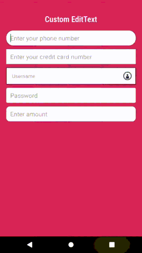

# Android - Custom InputBox

Custom InputBox control built for Android Apps. A collection of features wrapped in to single UI.

# Table of contents
- [Description](#description)
- [Features](#features)
- [Supported versions](#Supported-versions)
- [Demo](#demo)
- [Implementation](#implementation)
- [Want to Contribute?](#want-to-contribute)
- [Collection of Components](#collection-of-components)
- [Changelog](#changelog)
- [License](#license)
- [Keywords](#keywords)

## Description

A very simple and light weighted input box for android. A collection of features wrapped in to single UI. By adding line of code in xml able to access below features:

## Features

* EditText shape -> rounded corner with radius and changing BG color, Border color.
* Font change
* Password visibility icon when input type in password mode
* Custom Regex support
* Control to change cursor color
* Drawable click event
* Amount Regex
* Number custom regex
    For instance,
    "#### #### #### ####" as Credit Card Numbers,
    "(###)-(### ## ##)" as Phone Numbers,
    "##/##/####" as Dates etc.
* Android X support.

## Supported versions

We have tested this component in Android 9.0. You can still use it in other versions.

## Demo

## Implementation
### Import as Module

dependencies {
     implementation project(':custominputbox2')
}

Add this into settings.gradle file:

include ':custominputbox2'

### XML

    <?xml version="1.0" encoding="utf-8"?>
    <LinearLayout xmlns:android="http://schemas.android.com/apk/res/android"
      xmlns:app="http://schemas.android.com/apk/res-auto"
      xmlns:tools="http://schemas.android.com/tools"
      android:layout_width="match_parent"
      android:layout_height="match_parent"
      android:background="@color/colorPrimaryDark"
      android:orientation="vertical"
      android:padding="@dimen/_10sdp"
      tools:context=".MainActivity">

     <com.wkb.custominputbox2.CustomEditText
            android:layout_width="match_parent"
            android:layout_height="wrap_content"
            android:layout_margin="5dp"
            android:imeOptions="actionNext"
            android:digits="0123456789 ()-+/"
            app:edt_setBackgroundColor="@android:color/white"
            android:inputType="number"
            android:padding="10dp"
            app:edt_cursor="@android:color/holo_red_dark"
            app:edt_setBorderColor="@android:color/black"
            app:edt_setBorderView="true"
            app:edt_setCornerRadius="20dp"
            app:edt_setFont="@string/robotoRegular"
            app:edt_setStrokeWidth="0.5dp"
            app:pattern="(###)-(### ## ##)" />

            <com.wkb.custominputbox2.CustomEditText
            android:layout_width="match_parent"
            android:layout_height="wrap_content"
            android:layout_margin="5dp"
            android:hint="Password"
            android:imeOptions="actionDone"
            android:inputType="numberPassword"
            android:padding="10dp"
            app:edt_minLength="5"
            android:maxLength="10"
            app:edt_setBackgroundColor="@android:color/white"
            app:edt_setBorderView="true"
            app:edt_setCornerRadius="4dp"
            app:edt_setFont="@string/robotoRegular" />

    </LinearLayout>

## Custom Attributes
| Attributes | Format | Example |
| :---         |     :---      |          :--- |
| edt_cursor   | reference     | app:edt_cursor="@drawable/cursor"      |
| edt_setBackgroundColor   | color     | app:edt_setBackgroundColor="@android:color/white"      |
| edt_setBorderColor   | color     | app:edt_setBorderColor="@android:color/black"      |
| edt_setBorderView   | boolean     | app:edt_setBorderView="true"      |
| edt_setFont   | string     | app:edt_setFont="@string/robotoRegular"      |
| edt_setStrokeWidth   | dimension     | app:edt_setStrokeWidth="1dp"      |
| edt_setCornerRadius   | dimension     | app:edt_setCornerRadius="10dp"      |
| edt_minLength   | string     | app:edt_minLength="5"      |
| edt_regexp   | string     | app:edt_regexp="^[a-zA-Z0-9]+(([_][a-zA-Z0-9])?[a-zA-Z0-9]*)*$"   |
| edt_pattern   | string     | app:edt_pattern="#### #### #### ####"      |

## Want to Contribute?
- Created something awesome, made this code better, added some functionality, or whatever (this is the hardest part).
- [Fork it](https://docs.github.com/en/github/getting-started-with-github/fork-a-repo).
- Create new branch to contribute your changes.
- Commit all your changes to your branch.
- Submit a [pull request](https://docs.github.com/en/pull-requests).

## Collection of Components
We have built many other components and free resources for software development in various programming languages. Kindly click here to view our [Free Resources for Software Development](https://www.weblineindia.com/software-development-resources.html).

## Changelog
Detailed changes for each release are documented in [CHANGELOG.md](./CHANGELOG.md).

## License
[MIT](http://git-ar.webline.local/ADR/Custom_Input_box/blob/master/LICENSE)

## Keywords
edittext, custom-control, custom-edit-text, custom-input-box, android-input-box, android-custom-input-box